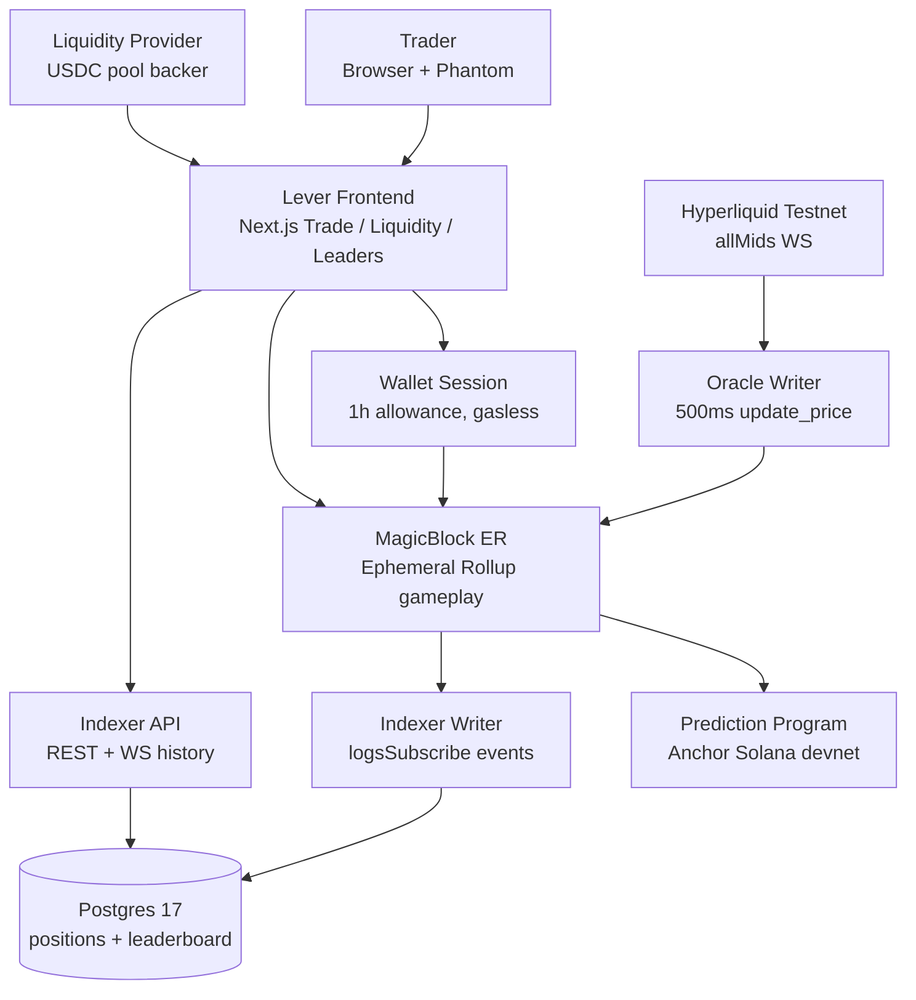
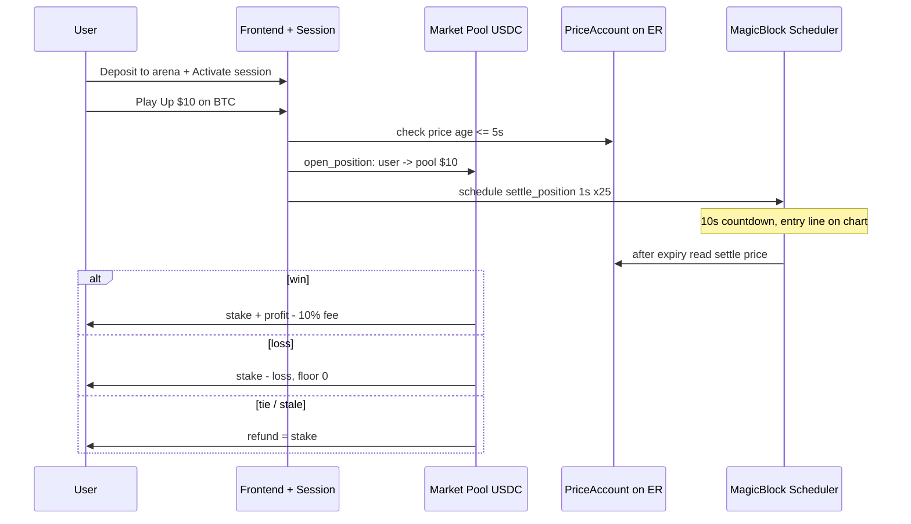

# Lever — 10-Second Leveraged Prediction Game (HyperBlock)

**Pick Up or Down on BTC, ETH, SOL, stocks, gold & forex. Stake $1–$1,000 USDC. Settles automatically 10 seconds after open. Win capped, loss floored at your stake. No liquidation, no early close.**

Built on Solana devnet + MagicBlock Ephemeral Rollups (gasless, sub-second gameplay) + Hyperliquid prices + Next.js + a read-only Rust indexer.

---

## How a round works

1. **Connect + session** — Phantom wallet, one 1-hour session allowance. After that, every play is one tap (session key signs, gasless on the ER).
2. **Pick direction + stake** — `Play Up` / `Play Down`, $1–$1,000 (presets $5/$10/$25), 1000× price sensitivity.
3. **Open** — `open_position` snapshots the on-chain `PriceAccount` (rejects if older than 5s), moves collateral user → pool, schedules `settle_position` on MagicBlock's native task scheduler (retry every 1s × 25).
4. **Watch 10s** — chart shows your entry line, countdown, and live estimate. Nothing can liquidate or close you early.
5. **Settle** — at `expires_at` the scheduler reads the price again:
   - **Won** → pool pays stake + profit − 10% fee
   - **Lost** → pool keeps up to the stake (floor 0)
   - **Tie / no price in the 10s buffer** → full refund (neutral, never shown as a loss)

### Payout math

`raw = stake × 1000 × directional_move`, gross capped at `5 × stake`, fee `10%` of gross.

- $10 Up, +0.6% move → raw $60 → capped $50 → fee $5 → **profit +$45, return $55**
- $10 Up, −0.6% move → raw −$60 → floored −$10 → **return $0**
- Caps: max profit **4.5×** stake, max return **5.5×** stake. Max 8 active positions per market plus a per-market exposure cap keep the pool solvent.

---

## System architecture



> Interactive version: open `docs/hyperblock-architecture.html` in a browser (double-click works — it's fully standalone). It has light/dark themes, pan/zoom, relationship tracing, three guided views (Trade path / Price path / Money and history), and PNG/SVG/WebM export. Spec: `docs/hyperblock.architecture.json` (validated showcase, 9/9 checks).

### Trade lifecycle



Full technical flow (every gate, account, and edge case): `docs/betting-flow.mmd` and its rendered `docs/betting-flow.html`.

### Money flow

- LPs deposit USDC into a per-`Market` pool (`deposit_liquidity` → internal shares, no LP mint).
- Trader wins → pool pays. Trader loses → pool keeps. 10% of profit splits LP + protocol.
- If the payout token account is closed at settle time, funds park in a fallback escrow the user later drains with `claim_fallback_payout`.
- The indexer is strictly read-only — it never signs and never touches money.

---

## Stack

| Layer | Tech |
|---|---|
| Chain | Solana devnet, Anchor program `CPUwSRL2h3mh27GutZ3k6hcHt4swrV1NcQAUuLQUbQYX` (`programs/leveraged-prediction/src/lib.rs`) |
| Speed | MagicBlock Ephemeral Rollups — delegated `Market`, `PriceAccount`, `UserPositions`, `UserLiquidity`, native scheduled settlement |
| Prices | Hyperliquid testnet `allMids` WS + REST → `update_price` every 500ms (`oracle-reference/src/index.ts`), 5s staleness gate |
| App | Next.js 16 + React 19 + Solana wallet adapter, Pixi chart hero, `1000×` engine mirror in `app/lib/domain.ts` |
| History | Rust indexer writer + API over Postgres 17 (`services/indexer/`), leaderboard + position stream |
| Markets | 100+ defined in `app/lib/markets.ts` (crypto + stocks + commodities + forex); oracle reference config covers 26 core assets |

## Repo map

```text
app/                 Next.js routes + components (trade, assets, liquidity, leaderboard, demo, real)
programs/leveraged-prediction/   Anchor program (open/settle, LP, PriceAccount, scheduling)
oracle-reference/    Hyperliquid → ER price writer (config.json, probe, init)
services/indexer/    Rust writer + API + Postgres migrations + deploy (Fly/Supabase)
docs/                betting-flow.mmd/html, hyperblock-architecture.html/json, lever-prototype.html
scripts/             bootstrap-devnet, check-devnet, local E2E harness
tests/               vitest suites + devnet oracle probe
```

Key docs: `DESIGN.md` (UI system), `DECISIONS.md` (deviations from spec), `DEMO.md` (60s hackathon script), `TODO.md`, `instructions.md`.

---

## Quickstart

```bash
pnpm install
cp .env.example .env.local
# fill NEXT_PUBLIC_* values (see below), then:
pnpm dev        # http://127.0.0.1:3000
```

Minimal `.env.local` (devnet defaults already in code, but set explicitly for Vercel):

```bash
NEXT_PUBLIC_SOLANA_RPC_ENDPOINT=https://rpc.magicblock.app/devnet
NEXT_PUBLIC_ROUTER_ENDPOINT=https://devnet-router.magicblock.app/
NEXT_PUBLIC_LEVERAGED_PREDICTION_PROGRAM_ID=CPUwSRL2h3mh27GutZ3k6hcHt4swrV1NcQAUuLQUbQYX
NEXT_PUBLIC_LEVERAGED_PREDICTION_MARKET_ID=1
NEXT_PUBLIC_EPHEMERAL_RPC_ENDPOINT=https://devnet-as.magicblock.app
NEXT_PUBLIC_HYPERBLOCK_API_URL=https://hyperblock-api.vercel.app
# optional: NEXT_PUBLIC_INDEXER_API_URL, NEXT_PUBLIC_SESSION_SETUP_LOOKUP_TABLE
# server: SOLANA_RPC_ENDPOINT, ROUTER_ENDPOINT, DEVNET_FAUCET_ENABLED=0 in production
```

The app tolerates missing/empty RPC env vars at build time (falls back to devnet defaults), but always set them in Vercel since `NEXT_PUBLIC_*` is baked at build.

```bash
pnpm check              # lint + typecheck + tests + build
pnpm test:e2e:local     # full local validator + ER + scheduler harness
pnpm test:oracle:devnet # live Hyperliquid probe (needs network)
cargo test -p leveraged-prediction --lib --locked
```

Oracle writer:

```bash
cd oracle-reference && pnpm install
pnpm probe              # validate Hyperliquid symbols
ORACLE_KEYPAIR_PATH=./oracle-keypair.json pnpm dev   # 500ms writer to ER
```

## Deploy (Vercel)

Import the repo, framework Next.js, build `pnpm run build`. Set the env vars above in Project Settings for Production + Preview, then redeploy on any env change. The `/_not-found` prerender fix (empty-string-safe RPC fallbacks in `app/providers/solana-provider.tsx`, `app/lib/live/client-config.ts`, `app/lib/live/config.ts`) is already in.

## Safety notes

- Devnet only — no mainnet deploys, no hardcoded keys.
- Betting is real-money logic on devnet test USDC; the 10s + 10s-refund windows and 8-position / exposure caps are consensus risk controls, not UI hints.
- Faucet authority (`DEVNET_FAUCET_AUTHORITY_BASE64`) is server-only; never prefix it with `NEXT_PUBLIC_*`.
